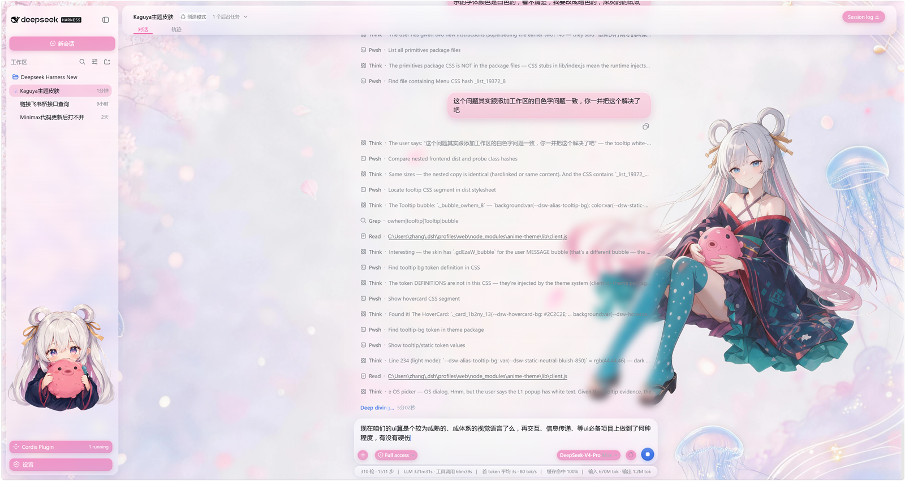
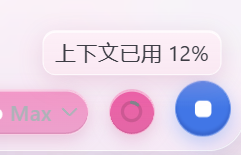
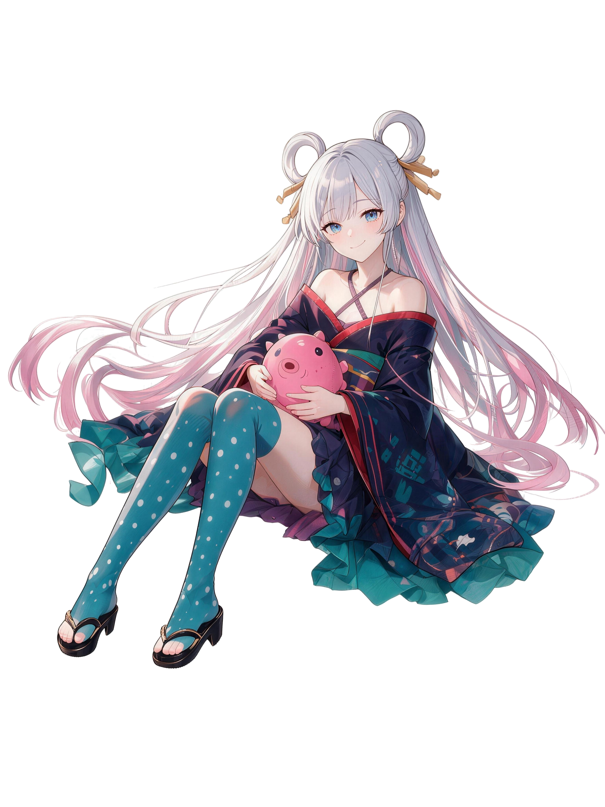

# anime-theme · Kaguya 液态玻璃皮肤

<p align="center">
  <b>樱花粉 × 液态玻璃 × 三态一致交互</b>
</p>

<p align="center">
  
  
  
  
</p>

给 **DeepSeek Harness Web** 的二次元（Kaguya）液态玻璃皮肤，浅色模式专属。

用官方 1/3 的改动面（13 面"墙"只刷 3 面 + 一层玻璃 CSS），换来完整的视觉世界观与统一的三态交互；深色模式 100% 保持官方原样，升级、切换主题零副作用。

## 📸 界面一览

<p align="center">
  
</p>

<details>
<summary>更多截图（上下文计量胶囊）</summary>
<p align="center">
  
</p>
</details>

| 素材 | 展示 |
| --- | --- |
| 玻璃后立绘（整页背景层） |  |
| 侧栏立绘（Kaguya_Q） |  |

---

## ✨ 特性

- **双层背景**：整页背景 = 玻璃后立绘（85% 不透明度）+ 全幅背景图 + 樱花白底 `#fdf3f8`，`fixed` 定位实现滚动时人物不动
- **悬浮玻璃侧栏**：侧栏是独立玻璃窗格（18px 圆角、白色亮边、柔和投影），内部内容全部透明化，底部带 Kaguya_Q 立绘
- **液态玻璃四件套**：半透明白/粉渐变底色 + `backdrop-filter: blur + saturate` + 亮边内高光 + 粉紫外投影
- **A/B/C/D 四类按钮**：A 粉玻璃重按钮 / B 轻按钮（悬停显形）/ C 蓝色发送键（保留官方蓝，悬停深一档）/ D 全局兜底（按压反馈）
- **三态一致交互**：静止 → 悬停（同轴加深一档）→ 按下（实色 + 内凹），全 UI 同一套手语
- **菜单条目模板 D**：静止透明黑字 → 悬停艳粉白字 → 按下深粉，全局菜单（含轨迹详情标题块、详情标签、设置区按钮、插件配置卡标题）统一
- **工具提示**：淡粉玻璃 + 深灰字，悬停解释永远看得清
- **设置区全覆盖**：模型页 / 预设页 / 插件配置卡（浓粉标题 + 淡粉正文两段式）/ 插件列表（浅粉玻璃状态徽章，语义绿灰保留）
- **上边栏细节**：后台任务菜单粉玻璃、「创造模式」预设小片独立液态玻璃胶囊
- **收起模式六键统一**：切换 / 新会话 / 添加 / 搜索 / 设置 / 日志，统一 36×36、同中线、同粉玻璃、12px 圆角矩形
- **斜杠命令面板目标行**：实心深粉 + 白字 + 行尾 `↵` 回车提示，一眼知道回车执行哪行
- **浅色限定**：所有规则用 `:not([data-ds-dark-theme])` 门控，**深色模式与官方完全一致**
- **语义色军规**：红/绿/黄/蓝（运行态、错误、成功、警告）永不改色，好看不让状态看不懂
- **素材零外链**：图片经 `build-skin.cjs` 压缩为 webp 并 base64 内嵌进皮肤包，无路径问题、无网络依赖
- **持久化挂载**：通过 `cordis.patch.yml` 挂载为真实 npm 包（非动态插件），重启不丢

---

## 📦 目录结构

```
anime-theme-1.1.0\
├── README.md               ← 本文件
├── 安装说明.md              ← 本机安装 / 恢复指南
├── cordis.patch.yml        ← 挂载行（一行把皮肤装进网页插件清单）
├── docs\
│   └── screenshots\        ← 界面截图（README 配图）
│       ├── main.png
│       └── token-meter.png
├── 源图\                    ← 4 张源图（换图后重新构建用）
│   ├── Background_Max.png
│   ├── kaguya_1.png
│   ├── Kaguya_Q.png
│   └── Left_Background.png
└── anime-theme\            ← 插件包（皮肤本体）
    ├── package.json        ← 包身份（v1.1.0）
    ├── lib\index.js        ← 宿主半边空壳
    ├── lib\client.js       ← 皮肤本体（3 面墙 + GLASS_CSS + 内嵌图片）
    ├── scripts\build-skin.cjs ← 图片压缩内嵌脚本
    ├── 设计规范.md           ← 规则手册 v2（改动前先查）
    ├── 设计语言.md           ← 设计语言总结
    ├── 交互模板.md           ← 6 套交互模板 + 变量账本
    └── 交互架构方案.md        ← 交互架构与可行性分析
```

---

## 🚀 快速开始

### 1. 安装皮肤包

把 `anime-theme` 文件夹复制到 profile 的 node_modules：

```
C:\Users\<用户名>\.dsh\profiles\web\node_modules\anime-theme\
```

### 2. 挂载

把下面的挂载行合并进 `C:\Users\<用户名>\.dsh\profiles\web\cordis.patch.yml`（文件不存在则直接复制过去）：

```yaml
- insert:
    - id: ui-anime-theme
      name: 'anime-theme'
```

### 3. 重启

重启 `dsh web`（新增挂载行需要重启；之后改颜色只需浏览器 F5）。

---

## 🎨 定制指南

| 想做什么 | 怎么做 |
| --- | --- |
| 改颜色 / 位置 | 编辑 `anime-theme\lib\client.js` → 保存 → 浏览器 **F5**（无需重启） |
| 换背景 / 立绘 | 替换 `源图\` 里同名文件（文件名写死）→ 在 `profiles\web` 下运行 `node node_modules\anime-theme\scripts\build-skin.cjs` → F5 |
| 改坏了想回滚 | 复制 `lib\client.js.bak-hover-bump` 或 `lib\client.js.snap-20260818-layered` 覆盖回来 |
| 卸载 | 从 `cordis.patch.yml` 删掉挂载行 → 重启 `dsh web` |

皮肤代码顶部的"13 面墙对照表"注释了每面墙的职责，想改哪面就点亮哪面。

---

## 🧭 设计语言

**主风格：液态玻璃（Liquid Glass，Apple 风）**，四件套配方贯穿全皮肤：

1. 半透明白/粉渐变底色（模拟玻璃厚度）
2. `backdrop-filter: blur + saturate`（真实模糊背后内容）
3. 亮边与内高光（`inset` 白色上高光 + 粉色下内影）
4. 柔和外投影（粉紫色调，元素"浮"在背景上）

**色彩系统：一根粉色轴** —— 品牌色 `#ec4899`（樱花粉），所有可交互色都是它的同轴深浅变体。

**形状语言**：侧栏玻璃 18px 圆角 / 卡片与按钮 12px / 胶囊 999px / 收起模式 36×36 圆角矩形。

**光影语言**：上高光（白）→ 主体渐变 → 下内影（深粉）→ 外投影（粉紫），四层同构。

完整的设计哲学与工程规范见 [`设计语言.md`](anime-theme/设计语言.md) 与 [`设计规范.md`](anime-theme/设计规范.md)。

---

## 🆚 与原版的区别

| 维度 | 原版（官方） | 本皮肤 |
| --- | --- | --- |
| 配色 | 中性蓝灰、白卡片 | 樱花粉玻璃、樱花白底 `#fdf3f8` |
| 背景 | 纯色 | 全幅背景图 + 人物立绘双层 |
| 侧栏 | 纯色填充、贴边 | 悬浮玻璃窗格 + 立绘 + 阴影 |
| 按钮 | 官方蓝主按钮、灰 hover | A/B/C/D 四类、粉色三态、按压内凹 |
| 收起模式图标 | 圆形 | 36×36 圆角矩形、统一粉玻璃 |
| 菜单悬停 | 灰 `interactive-bg-hover` | 粉玻璃加深（白纱 + 深粉 22%） |
| 命令面板目标行 | 灰色高亮 | 实心深粉 + 白字 + `↵` 提示 |
| 深色模式 | 官方暗色 | **完全不动（与官方一致）** |

---

## ⚖️ 已知权衡

**优势**

- 沉浸感与个性：立绘 + 玻璃 + 樱花粉形成完整世界观
- 交互反馈完整：全 UI 三态分明，操作"手感"一致
- 浅色限定 = 风险隔离：深色模式零改动，升级或切换主题无副作用
- 语义色保留：状态颜色不牺牲，可读性与安全性不降
- 工程化：13 面墙精确分工、文档同步、备份可回滚

**代价 / 风险**

- 对比度上限低：粉色系在浅粉玻璃上天生柔和，追求"明显"必须牺牲"柔和"
- 性能开销：大量 `backdrop-filter` 模糊层在低端设备上可能掉帧
- 升级脆弱：依赖官方哈希类名（如 `.hHd-Xa_*`），官方改版后需要跟随维护
- 高度个性化：属于"专属皮肤"而非"通用主题"

> 一句话：用官方 1/3 的改动面，换来完整的视觉世界观和统一的三态交互；代价是粉色系的对比度天花板和对官方类名的维护依赖。

---

## 📜 版本历史

- **v1.1.0（2026-08-19）**：设置区全覆盖 + 交互定稿。新增：工具提示深灰字、后台任务菜单粉玻璃、「创造模式」预设小片液态玻璃胶囊、插件配置卡两段式（浓粉标题 + 淡粉正文 + 悬停白字）、插件状态徽章浅粉玻璃、轨迹详情标题块/详情标签模板 D（悬停艳粉白字）、蓝色发送键悬停加深（黑 7%→15%）、左下立绘按 27″4K 下移 8mm（160px→109px）；配套文档新增 `交互模板.md` 与 `交互架构方案.md`。
- **v1.0.0（2026-08-18）**：首个定稿版。包含：悬浮玻璃侧栏 + 立绘、双层壁纸、A/B/C/D 四类按钮三态、收起模式六键统一、轨迹界面完整设计语言（层叠标题块 + 终端卡代码区）、输入框占位符改写、全局圆角兜底。

---

## 📄 许可

个人项目，目前未设置开源许可证。仅供个人使用与学习交流。
